# DovaKel

**DovaKel** is an esoteric programming language written for Dragons, Dragonborn, Greybeards, and other students of the Way of the Voice. It is based off  The Elder Scrolls V: Skyrim in which written words of power used  are used by those with a capacity for the Thu’um, the dragon tongue of Tamriel. This language attempts to use natural linguistic and cultural processes of dragons to make writing programs easier for Skyrim’s dragons and Dragonborn. Created on June 3rd, 2025 by Isaac Burstyn.

## Alphabet

**DovaKel** uses the dragon alphabet runic symbols. Phonetic equivalents in the roman alphabet can be found below:
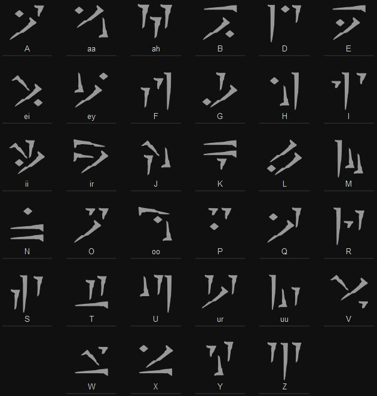

## Commands

**DovaKel** operates on a collection of Dragon objects which each hold a numeric value, initially set to zero. Each Dragon has a unique name defined when it is created. The commands are:

|Runic	|Latin	|Description
|----------------|-------------------|-----------|
|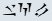	|Wahl [Name(s)]|Defines a dragon (or dragons) used as a variable later in the program. Names are separated by spaces.
|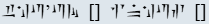	|Thu’um [Name] inhus [Sequence of shouts]|This command sets the given dragon's number based on the number and sequence of shouts.*
|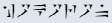	|Hokoron [Name]|Set the dragon's number to its opposite.
|	|Nil [Name]|Set the dragon's power level to zero.
|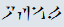	|Ofaal [Name]|Read an input from STDIN and store it in the dragon as a number or ASCII value if it is a character.
|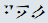	|Pel [Name]| Print the ASCII character  that corresponds to the value held by the dragon to STDOUT.
|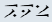|Bex [Name]|Print the number held by the dragon to STDOUT.
|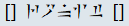|[Name] Ronit [Expression or Name]|Sets the value stored in the dragon on the right side to the result of the left side.
|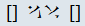	|[Name] Aav [Name]|Return the sum of the numbers of two dragons.
|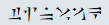	|Tinvaak [Name]| Jump past the next Nahlot command with the same dragon if the dragon holds zero.
|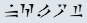|Nahlot [Name]    |   Return to the last Tinvaak command for the dragon.     

### Shouts and Words of Power (Number System)*
Dragons in Tamriel don't use numbers so each dragon has a number that can be thought of as a might magnitude. The number associated with the dragon is calculated by the number of words of power the dragon knows in each shout. Each shout with a single word known adds 1 to the assigned number. Each shout with two words known adds 10 to the assigned number. Each shout with all three words known adds 100 to the assigned number. 
You must always start with the first word in a shout in the sequence.  Each successive word in the shout should come after the previous word in the shout in order to count towards the number assigned to the dragon for that shout. For example the sequence Fus Ro Dah Fus Ro counts as 110, Fus Ro Fus Fus counts as 12, and Fus Fus Fus counts as 3. The sequence Ro Fus Dah  is invalid because the sequence does not start with the first word of power in any shout. 
Although it is bad form to reuse the same shout over and over for a single **Thu'um** call it is not against the syntax. The shouts are:
|Shout| First Word | Second Word | Third Word
|--|--|--|--|
|Animal Allegiance| Raan (animal)| Mir (allegiance)| Tah (pack)
|Aura Whisper| Laas (life)| Yah (seek)|Nir (hunt)
|Battle Fury| Mid (loyal)| Vur (valor)| Shaan (inspire)
|Become Ethereal| Feim (fade)| Zii (spirit)| Gron (bind)
|Bend Will| Gol (earth)| Hah (mind)|Dov (dragon)
|Call Dragon| Od (snow)| Ah (hunter)| Viing (wing)
|Call of Valor| Hun (hero)| Kaal (champion)| Zoor (legend)
|Clear Skies| Lok (sky)| Vah (spring)| Koor (summer)
|Cyclone| Ven (wind)|Gaar (unleash)| Nos (strike)
|Disarm| Zun (weapon)| Haal (hand)| Viik (defeat)
|Dismay| Faas (fear)| Ru (run)| Maar (terror)
|Dragon Aspect| Mul (strength)| Qah (armor)| Diiv (wyrm)
|Dragonrend| Joor (mortal)| Zah (finite)| Frul (temporary)
|Drain Vitality| Gaan (stamina)| Lah (magicka)| Haas (health)
|Elemental Fury| Su (air)| Grah (battle)| Dun (grace)
|Ice Form| Iiz (ice)| Slen (flesh)| Nus (statue)
|Kyne's Peace|Kaan (Kyne)|Drem (peace)| Ov (trust)
|Marked for Death| Krii (kill)| Lun (leech)| Aus (suffer)
|Slow Time| Tiid (time)| Klo (sand)|Ul (eternity)
|Soul Tear| Rii (essence)| Vaaz (tear)| Zol (zombie)
|Storm Call| Strun (storm)|Bah (wrath)| Qo (lightning)
|Summon Durnehviir| Dur (curse)| Neh (never)| Viir (dying)
|Throw Voice| Zul (voice)| Mey (fool)| Gut (far)
|Unrelenting Force| Fus (force)| Ro (balance)| Dah (push)
|Whirlwind Sprint| Wuld (whirlwind)| Nah (fury)| Kest (tempest)

## Brainfuck Map

Unlike **brainfuck**, **DovaKel** is based off dragon objects so the "<" and ">" commands are satisfied by the ability to create spaces in memory to hold numbers via the "Wahl" command. For each of the following mappings assume that **Alduin** in the **DovaKel** command call has been initialized and is analog to the cell the pointer is pointing to in brainfuck.

|BF Command|DovaKel Analog (Latin) |
|--|--|
| + |`Wahl Nazeem` `Thu'um Nazeem inhus Fus` `Alduin Ronit Nazeem Aav Alduin`
| - | `Wahl Nazeem` `Thu'um Nazeem inhus Fus` `Hokoron Nazeem` `Alduin Ronit Nazeem Aav Alduin`
| . | `Pel Alduin` |
| , | `Ofaal Alduin` |
| [ | `Tinvaak Alduin` |
| ] | `Nahlot Alduin` |

**DovaKel** is Turing complete!!

 ## Hello World
 This program prints "Hello World!" to the console.
 
**DovaKel**:
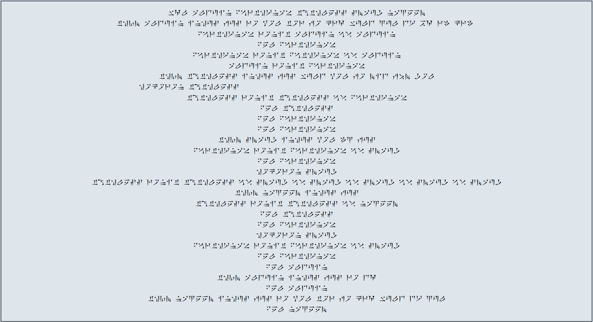
**DovaKel** Translated:

	Wahl Alduin Paarthurnax Toothless Smaug Nazeem​
	Thu'um Alduin inhus Fus Ro Yol Tor Fo Krah Wuld Zul Dur Bah Rii  Krii  ​
	Paarthurnax Ronit Alduin Aav Alduin 					// Paarthurnax = 72​
	Pel Paarthurnax​
	Paarthurnax Ronit Paathurnax  Aav Alduin 				// Paarthurnax = 108​
	Alduin Ronit Paarthurnax           				// Alduin = 108​
	Thu'um Toothless inhus Fus Wuld Yol Fo Mid Feim Gol​
	Hokoron Toothless 										// Toothless = -7​
	Toothless Ronit Toothless Aav  Paarthurnax 				//Toothless = 101​
	Pel Toothless​
	Pel Paarthurnax​
	Pel Paarthurnax​
	Thu'um Smaug inhus Yol Iiz Fus 							// Smaug = 3​
	Paarthurnax Ronit Paarthurnax  Aav Smaug //Paarthurnax = 111​
	Pel Paarthurnax​
	Hokoron Smaug            						// Smaug = -3​
	Toothless Ronit Toothless Aav Smaug Aav Smaug Aav Smaug Aav Smaug Aav Smaug​
	Thu'um Nazeem inhus Fus           				// Nazeem = 1​
	Toothless Ronit Toothless Aav Nazeem   				// Toothless = 87​
	Pel Toothless​
	Pel Paarthurnax​
	Hokoron Smaug              					// Smaug = 3​
	Paarthurnax Ronit Paarthurnax  Aav Smaug   			// Paarthurnax = 114​
	Pel Paarthurnax​
	Pel Alduin​
	Thu'um Alduin inhus Fus Ro Dah        				// Alduin = 100​
	Pel Alduin​
	Thu'um Nazeem inhus Fus Ro Yol Tor Fo Krah Wuld Dur Zul	// Nazeem = 33​
	Pel Nazeem

## Countdown
This program takes a positive integer as an input and prints a countdown starting at the number all the way to zero.

**DovaKel**:
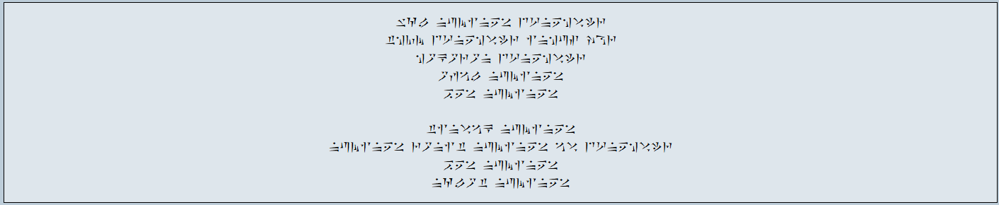

**DovaKel** Translated:

    Wahl Numinex Durnehviir
    Thu'um Durnehviir inhus Joor
    Hokoron Durnehviir								//Durnehviir = -1
    Ofaal Numinex
    Bex Numinex
    
    Tinvaak Numinex									//Start loop
    Numinex Ronit Numinex Aav Durnehviir
    Bex Numinex
    Nahlot Numinex
    

    

## References
- https://www.thuum.org/
- https://www.thuum.org/learn/grammar/alphabet.php
-  https://en.uesp.net/wiki/Lore:Thu%27um

